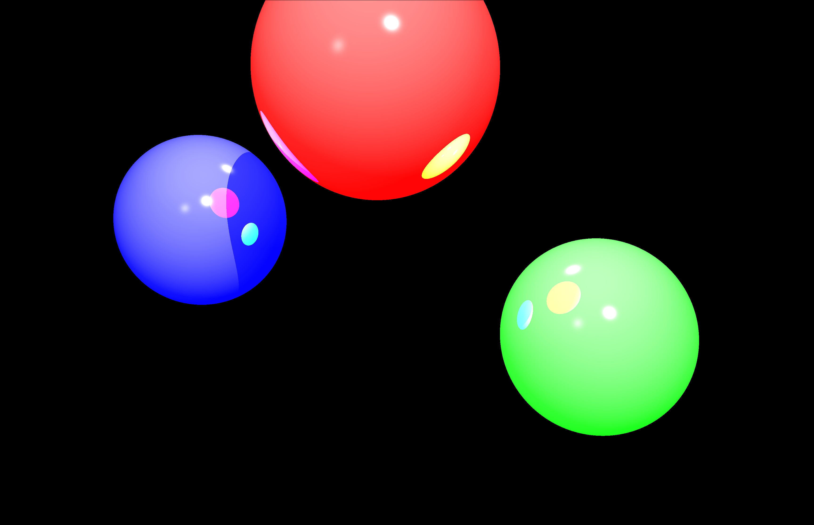

# 3D-Renderer
I have created a 3d renderer that takes in the locaiton and properties of a few lights, spheres, and a camera and spits out a 2d image of the objects
It also has multithreading capability which in my expirience has increased the speed by more than 4 times the original.

