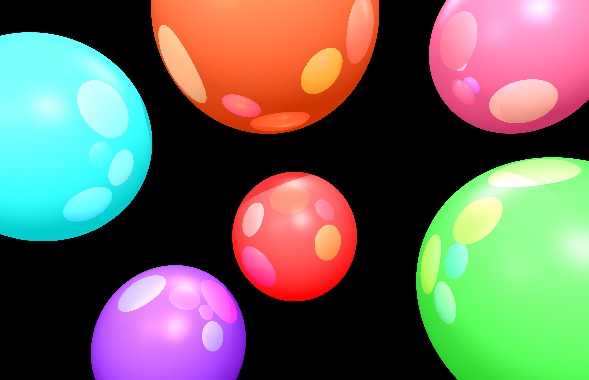

# 3D-Renderer
I have created a 3d renderer that takes in the locaiton and properties of a few lights, spheres, and a camera and spits out a 2d image of the objects
It also has multithreading capability which in my expirience has increased the speed by more than 4 times the original.

I followed the guide found here: https://avikdas.com/build-your-own-raytracer/
I used it as a rough guide for my project. I followed all of the math parts of the guide, but the implementation of everything was done on my own.

Here are my 2 favorite images I have rendered:
  
